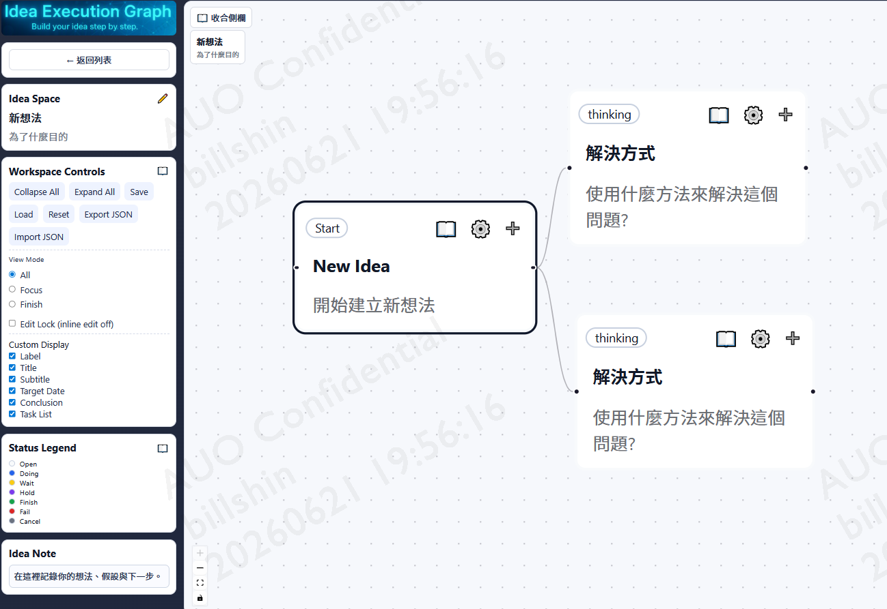

# Idea Execution Graph

用來整理與追蹤想法執行流程。
簡單說就是:心智圖 + 任務task + 狀態status

Demo Page:
資料存於LocalStorage，無法跨裝置、無法備份、無法多人協作。後端開發中...
https://billshin.github.io/Idea-Execution-Graph/



## 功能簡介

- Idea 清單首頁（建立、刪除、進入編輯）
- Graph 編輯頁（節點、連線、展開收合、焦點模式）
- Idea Space（標題、副標、目標日期）
- Task Parking Lot（筆記與待辦）
- 本機儲存（localStorage，自動保存）
- JSON 匯入 / 匯出


## 快速開始

1. 進入前端資料夾

```bash
cd idea-graph-app
```

2. 安裝套件

```bash
npm install
```

3. 啟動開發模式

```bash
npm run dev
```

預設會開在 `http://localhost:5173`。

## 建置

```bash
cd idea-graph-app
npm run build
```

## 技術

- React + TypeScript
- Vite
- Zustand
- React Flow

